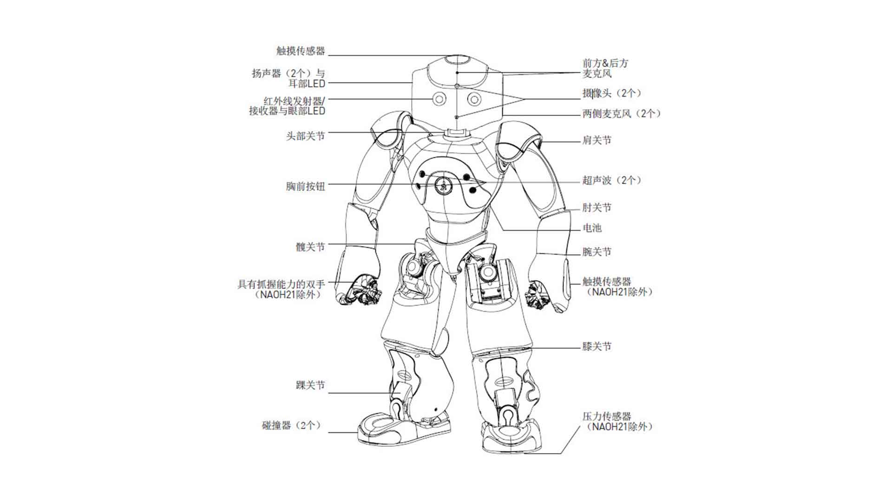

##### NAO机器人是一款人工智能机器人。它拥有着讨人喜欢的外形，而且具备有一定水平的人工智能，能够与人亲切的互动。

##### 本次机器人看到了很多强队采用了Bhuman程序代码 实现了队伍的奔跑打球佩服不已

##### 比赛之后也曾尝试在linux上面刷过一次 但是不知道怎么把这么大的文件放进内存仅1G不到的机器人里面，强队还是强，也希望自己能紧随他们的步伐早日变成某一方面的大佬附上BHuman的 [链接BHuman](https://github.com/ppzxc/BHumanCodeRelease)